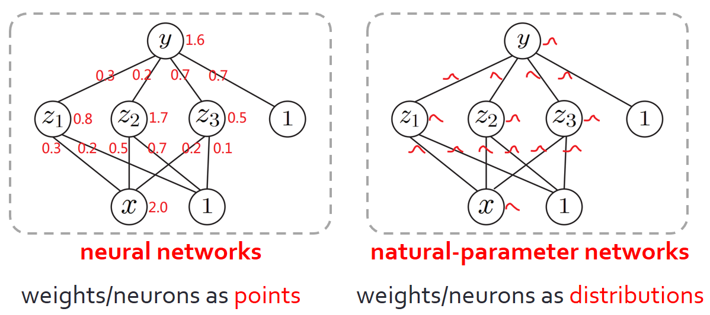
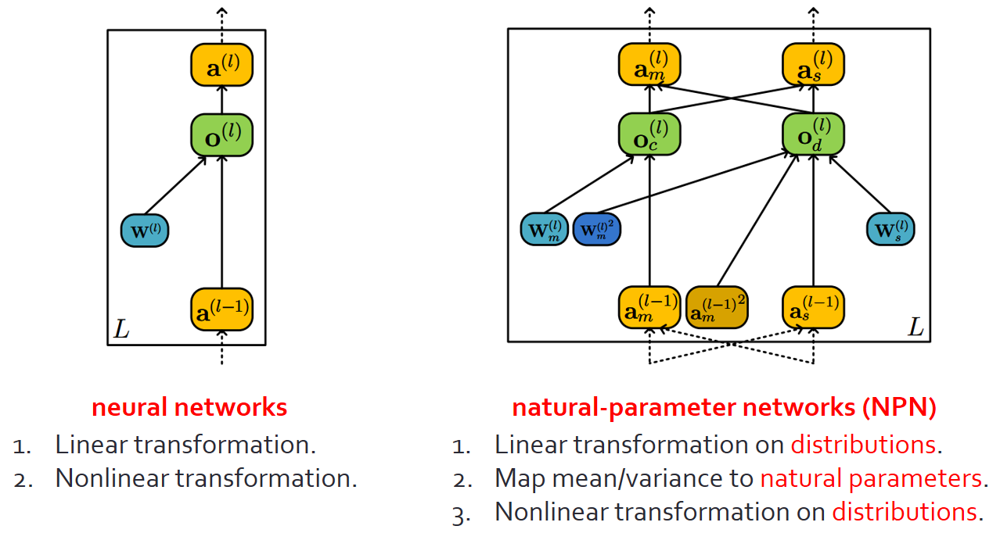
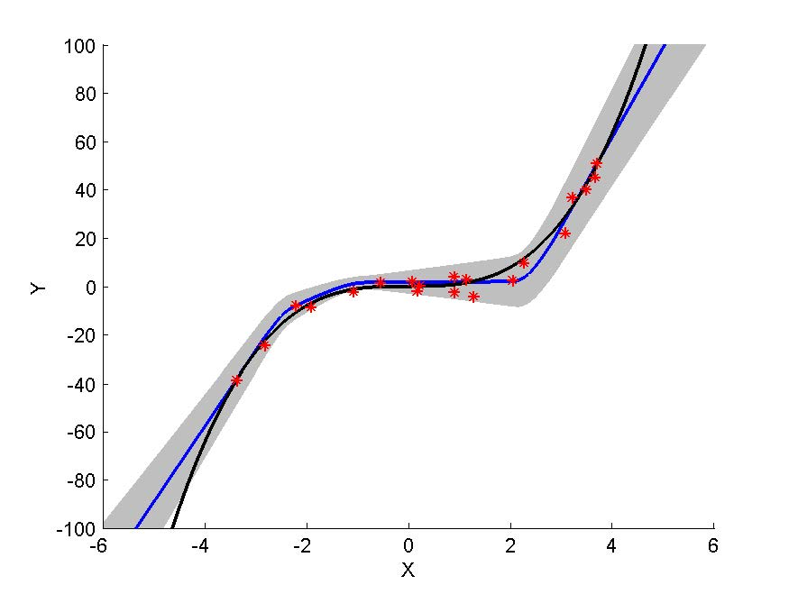

Natural-Parameter Networks (NPN) in Matlab
================

This is the code for the NIPS paper ['Natural-Parameter Networks: A Class of Probabilistic Neural Networks'](http://wanghao.in/paper/NIPS16_NPN.pdf). 

It is a class of probabilistic neural networks that treat both weights and neurons as distributions rather than just points in high-dimensional space. Distributions are first-citizens in the networks. The design allows distributions to feedforward and backprop across the network. Given an input data point, NPN will output a predicted distribution with information on both the prediction and uncertainty.

NPN can be used either independently or as a building block for [Bayesian Deep Learning](http://wanghao.in/paper/TKDE16_BDL.pdf) (BDL).

Note that this is the code for Gaussian NPN to run on the MNIST and Boston
Housing datasets. For Gamma NPN or Poisson NPN please go to the other repo.

## Neural networks v.s. natural-parameter-networks in two figures:

### Distributions as first-class citizens:

<p align="center">

</p>

### Closed-form operations to handle uncertainty:

<p align="center">

</p>

## Example results:
<p align="center">

</p>
Above is the predictive distribution for NPN. The shaded regions correspond
to 3 standard deviations. The black curve is the data-generating function and blue curves
show the mean of the predictive distributions. Red stars are the training data.

## How to run the code:

To train the model, run the command:
'cd example'
to go to the directory of the entry point and run
'./run.sh'  or  'sh run.sh'

example/run.sh: entry point
mlp_bayes.m: core model code
default_mlp_bayes.m: initialize NPN

## PyTorch implementation:

Official PyTorch version of NPN can be found [here](https://github.com/js05212/PyTorch-for-NPN).

## Other implementations (third-party):

Pytorch/Python code (with extension to GRU) by [sohamghosh121](https://github.com/sohamghosh121/natural-parameter-networks).

## Reference:
[Natural-Parameter Networks: A Class of Probabilistic Neural Networks](http://wanghao.in/paper/NIPS16_NPN.pdf)
```
@inproceedings{DBLP:conf/nips/WangSY16,
  author    = {Hao Wang and
               Xingjian Shi and
               Dit{-}Yan Yeung},
  title     = {Natural-Parameter Networks: {A} Class of Probabilistic Neural Networks},
  booktitle = {Advances in Neural Information Processing Systems 29: Annual Conference
               on Neural Information Processing Systems 2016, December 5-10, 2016,
               Barcelona, Spain},
  pages     = {118--126},
  year      = {2016}
}
